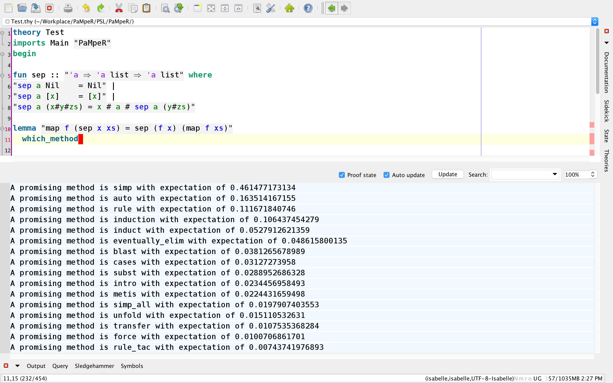
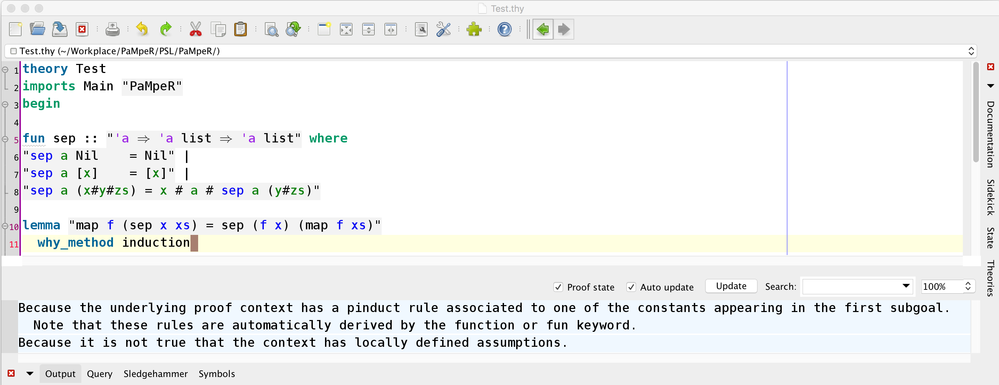

# PaMpeR (Proof Method Recommendation system)

## Installation
1. Install [Isabelle](https://isabelle.in.tum.de/).
2. Download or clone this repository (git clone https://github.com/data61/PSL.git).
3. Move to the PaMpeR branch (https://github.com/data61/PSL/tree/PaMpeR).
4. Then, Users can install PaMpeR by importing *.PaMpeR/PaMpeR.thy* to their theory files
   with the Isabelle keyword, **imports**.
   
## Three PaMpeR Commands
- The keyword **which_method** lists the 15 most promising proof methods for the current given proof state as well as the numerical expectation for each of them.

- The keyword **why_method** takes a name of proof method and tells why PaMpeR recommends the proof method for the current given proof state.

- The keyword **rank_method** shows the rank of a given proof method to the current proof state in comparison to other proof methods.

## Preliminary Evaluation
- The details of preliminary evaluation is presented in PSL/PaMpeR/Evaluation/README.md

## Contents
- **PaMpeR.thy**: The main theory file of PaMpeR. Users can install PaMpeR by importing this theory file into their own theory file.
- **Assertions.ML**: This file contains 60 assertions we developed to extract feature values from proof states.
- **method_names**: This file contains the list of proof method names appearing our target proof corpora, Isabelle's standard library. If users optimize PaMpeR based on their own proof corpora, this list will be updated.
- Note that the following four sub-directories are useful only for those people who want to optimize PaMpeR or those who want to reproduce our preliminary evaluation of PaMpeR.
   - **Build_Database**: This Isabelle session extracts feature vectors from proof corpora and build a file called Database in PSL/PaMpeR/Build_Database.
   - **Preprocess**: This Isabelle session converts the raw database produced by Build_Database to a group of databases and store these databases in PSL/PaMpeR/Databases. Each database in PSL/PaMpeR/Databases corresponds to a proof method used in the training data. This transformation converts our multi-output regression problem to a group of single-output regression problem.
   - **Build_Regression_Tree**: This Isabelle session takes the databases in PSL/PaMpeR/Databases and analyse them to produce regression trees for each proof method.
   - **Evaluation**: This Isabelle session contains the details of preliminary evaluation included in the ITP2018 paper submission and the tool necessary to reproduce the results. This session creates **evaluation.txt** in PSL/PaMpeR/Evaluation. This file contains raw evaluation results. 
   - **Postprocess**: This Isabelle session analyzes **evaluation.txt** in PSL/PaMpeR/Evaluation and creates **eval_result.txt**
in PSL/PaMpeR/Postprocess to summarize the evaluation results.
