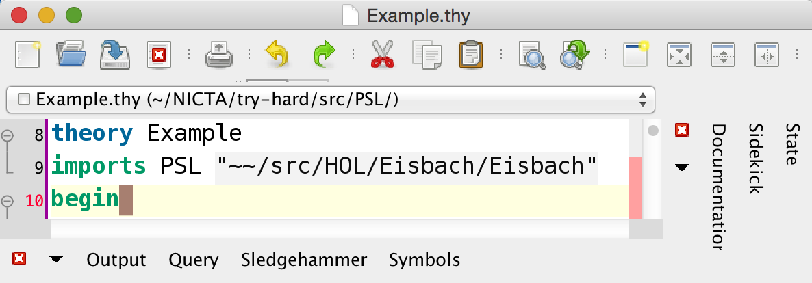
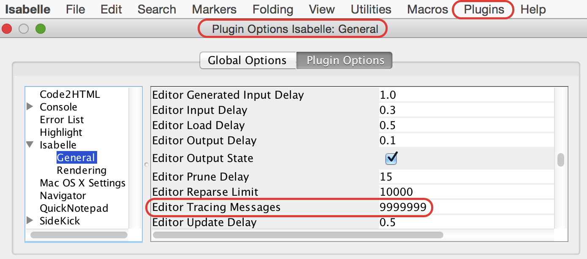
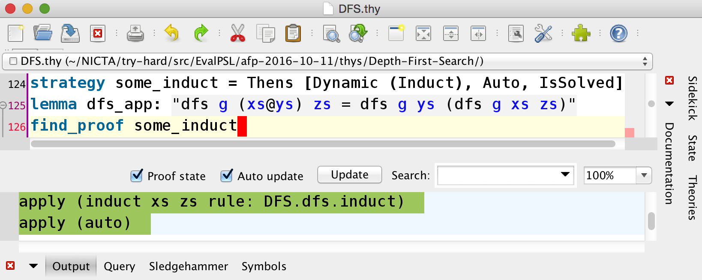
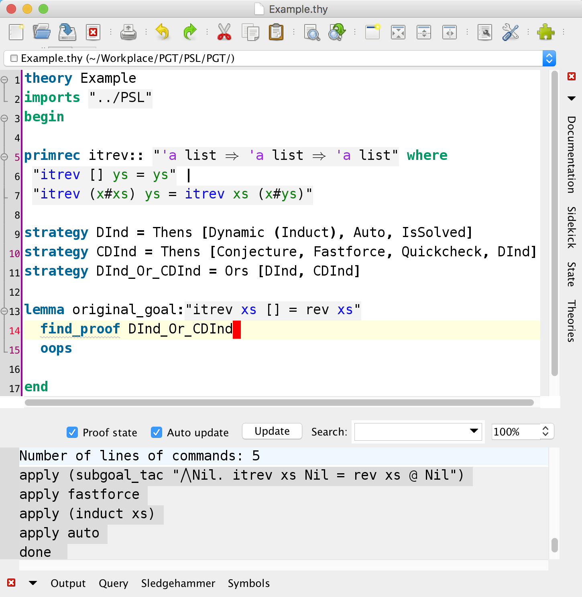

**This is the development version of PSL, PaMpeR, LiFtEr, Smart_Induct, and SeLFiE, where we try out possibly immature ideas. The latest stable release is [here](https://github.com/data61/PSL/releases/tag/0.1.7-alpha).**

# PSL

This repository contains the implementation of *proof strategy language (PSL)* and its default strategy,
**try_hard**, for [Isabelle20**20**](https://isabelle.in.tum.de). Previous versions of Isabelle, such as Isabelle2019, are no longer supported.

## Installation
1. Install [Isabelle2020](https://isabelle.in.tum.de).
2. Download or clone this repository (git clone https://github.com/data61/PSL.git).
3. Open Isabelle/jEdit with PSL and all that. You can do this by opening Isabelle/jEdit as following:
   * `(path to the Isabelle binary)isabelle jedit -d (path to the directory that contains this README file) -l Smart_Isabelle`
   * If you are a MacOS user and your current directory is this one with this README.md, probably you should type something like this in Terminal:
   * `/Applications/Isabelle2020.app/Isabelle/bin/isabelle jedit -d . -l Smart_Isabelle`
4. Then, You can install PSL and try_hard by importing *.PSL.thy* to their theory files
   with the Isabelle keyword, **imports** as ``imports "PSL.PSL"``.

If you find it difficult to install our tool, please refer to [the Isabelle System Manual](https://isabelle.in.tum.de/doc/system.pdf). Alternatively, you can just send an email to Yutaka at Yutaka.Nagashima(at)cvut.cz.

## Basic Commands
- The keyword **strategy** defines a new strategy.
- The keyword **find_proof** invokes PLS's runtime system searching for a proof based on a given strategy.
- The keyword **try_hard** searches for a proof based on the default strategy. Upon success, it discharges the first sub-goal or all the sub-goals in a given proof obligation.
- The keyword **try_hard_one** is similar to try_hard, but focuses only on the first sub-goal.
- The keyword **try_hard_all** is similar to try_hard, but tries to discharge all sub-goals.
- The keyword **try_parallel** is similar to try_hard, but exploits parallelism.

## Hints
PSL's runtime tactic generation can result in a large number of messages in Isabelle/jEdit's output panel.
This might cause Isabelle/jEdit to pause PSL's proof search after reaching its default upper limit for tracing messages.
- One can circumvent this situation by changing the upper limit to an extreamly large number, say 99999999.
- One can change the upper limit for tracing messages via jEdit's menus:
  Plugins => Plugin Options => Isabelle => General => Editor Tracing Messages.

## Contents
- `PSL/Utils.ML` includes various utility functions.
- `PSL/Subtool.ML` treats Isabelle's subtools as state-monad tactics.
- `PSL/Dynamic_Tactic_Generation.ML` facilitates runtime tactic generation.
- `PSL/Constructor_Class.ML/` is a general purpose constructor class library.
- `PSL/Instantiation.ML` instantiates some type constructors as members of constructor classes.
- `PSL/Monadic_Prover.ML` contains the interpreter of PSL.
- `PSL/Parser_Combinator.ML` contains general purpose monadic parser combinators.
- `PSL/PSL_Parser.ML` defines the PSL parser.
- `PSL/Isar_Interface.thy` sets up the Isabelle/Isar interface for PSL.
- `PSL/Try_Hard.thy` defines the default strategy try_hard.
- `PSL/PSL.thy` reads all the necessary files to use PSL and try_hard.
- `Example/Example.thy` presents small example strategies and use cases.
- `PaMpeR/` is a tool for **p**roof **m**thod **r**commendation.
- `MeLoId/` is work in progress.
- `LiFtEr/` is a language to encode induction heuristics.

## FAQs
*Q1.* Why yet another tactic language? How is PSL different from, say, Eisbach?

*A1.* PSL’s runtime system attempts to generate efficient proof scripts from a given strategy by searching for the appropriate specialisation and combination of tactics for a particular conjecture without direct user interaction. Eisbach does not generate methods dynamically, trace proof attempts, nor support parallelism natively. Eisbach is good when engineers already know how to prove their conjecture in Isabelle, while PSL is good when they want to find out how to prove it.

*Q2.* To be honest, I do not have time to learn a new language. Can I still use PSL without learning its syntax?

*A2.* We made PSL’s syntax similar to that of Isabelle’s tactic language to lower the learning barrier of PSL. But if you do not feel writing your custom strategy, enter *try_hard*. It invokes the default strategy, TryHard. The lack of input from human engineers on the proof obligation at hand makes TryHard less specific to each conjecture; however, we made TryHard more powerful than existing proof automation tools for Isabelle by specifying larger search spaces.

*Q3.* How much computational resources do I need to use PSL / try_hard?

*A3.* The more is the better. You can increase the power of your strategy by using parallel combinators, such as *POrs* and *PAlts*.

*Q4.* It looks like PSL's proof search got stuck due to the high volume of traing messages. How can I keep it running?

*A4.* You can change the upper limit for tracing messages via jEdit's menus: Plugin Options => Isabelle => General => Editor Reactivity => Editor Tracing Messages.

*Q5.* try_hard keeps running for more than five minutes. How long should I wait to get a proof for this conjecture?

*A5.* It depends on how difficult your conjecture is. try_hard starts with simple proof strategies that usually do not take much time and tries more time consuming strategies if simple strategies cannot find a proof. If it keeps running for more than six hours, I would start writing proofs manually.

*Q6.* Why try_hard? Why not sledgehammer?

*A6.* sledgehammer is good when you want to get a proof quickly, while try_hard is good when you have a longer time for proof search. [Our evaluation](https://arxiv.org/abs/1606.02941) shows that given 300 seconds of time-out for each proof goal try_hard solves 1115 proof goals out of 1526, while sledgehammer found proofs for 901 of them using the same computational resources and re-constructed proofs in Isabelle for 866 of them. This is a 14 percentage point improvement of proof search and a 16 percentage point increase for proof reconstruction. Moreover, 299 goals (20% of all goals) were solved only by try_hard within 300 seconds. try_hard is especially good at discharging proof obligations that can be nicely handled by by a) mathematical (co)induction, b) general simplification rules, or c) specialised tactics.

*Q7.* What are `Generalize` and `Conjecture`? Which proof methods will PSL generate for these atomic strategies?

*A7.* *Generalize* and *Conjecture* are new additions to PSL's atomic proof strategies. Given a proof obligation, *Generalize* attempts to create conjectures by generalizing the proof obligation in various ways and insert each of them as a subgoal of the original proof obligation. *Conjecture* works similarly to *Generalize*; However, *Conjecture* also tries to mutate the original proof obligation as well as generalization of the original obligation. *Generalize* and *Conjecture* are still experimental, and we do not have an evaulation results. The example file (PGT/Example.thy) contains an example of how it works. We attached a screenshot of this file in the following. For more details, please find our tool paper accepted at [11th Conference on Intelligent Computer Mathematics (CICM2018)](https://cicm-conference.org/2018/cicm.php).

## Documentations
We published academic papers describing the ideas implemented in this project.
- A Proof Strategy Language and Proof Script Generation for Isabelle/HOL at [CADE2017](http://www.cse.chalmers.se/~myreen/cade-26/) explains the overall idea of PSL. ([arXiv](https://arxiv.org/abs/1606.02941)/[Springer](https://doi.org/10.1007/978-3-319-63046-5_32))
- Goal-Oriented Conjecturing for Isabelle/HOL at [CICM2018](https://cicm-conference.org/2018/cicm.php) explains the conjecturing framework implemented as `Generalize` and `Conjecture` in `PSL/PGT`. ([arXiv](https://arxiv.org/abs/1806.04774)/[Springer](https://doi.org/10.1007/978-3-319-96812-4_19))
- PaMpeR: Proof Method Recommendation System for Isabelle/HOL at [ASE2018](http://ase2018.com) explains the proof method recommendation system implemented in `PSL/PaMpeR`. ([arXiv](https://arxiv.org/abs/1806.07239)/[ACM](http://doi.acm.org/10.1145/3238147.3238210))
- LiFtEr: Language to Encode Induction Heuristics for Isabelle/HOL at [APLAS2019](https://conf.researchr.org/home/aplas-2019) explains our domain specific language to encode induction heuristics. ([arXiv](https://arxiv.org/abs/1906.08084)/[Springer](https://doi.org/10.1007/978-3-030-34175-6_14))
- smart_induct: Smart Induction for Isabelle/HOL (Tool Paper) accepted at [FMCAD2020](https://fmcad.forsyte.at/FMCAD20/).  (The draft is available at [Zenodo](https://doi.org/10.5281/zenodo.3960303).)
- Simple Dataset for Proof Method Recommendation in Isabelle/HOL (Dataset Description) at [CICM2020](https://cicm-conference.org/2020/cicm.php). ([arXiv](https://arxiv.org/abs/2004.10667)/[Springer](https://doi.org/10.1007/978-3-030-53518-6_21))

We presented the final goal of this project at [AITP2017](http://aitp-conference.org/2017/). Our position paper "Towards Smart Proof Search for Isabelle" is available at [arXiv](https://arxiv.org/abs/1701.03037).

We are currently developing ``MeLoId``, an extension to `PSL` to improve its proof automation. Our position paper "Towards Machine Learning Induction" is available at [arXiv](https://arxiv.org/abs/1812.04088). We presented this abstract at [AITP2019](http://aitp-conference.org/2019/), [LiVe2019](https://www7.in.tum.de/~kretinsk/LiVe2019.html), and [ML2019](https://icfp19.sigplan.org/home/mlfamilyworkshop-2019).

We also plan to improve the proof automation using evolutionary computation. We presented our plan during the poster session at [GECCO2019](https://gecco-2019.sigevo.org/index.html/HomePage). Our poster-only paper is available at [ACM digital library](https://doi.org/10.1145/3319619.3321921) and [arXiv](https://arxiv.org/abs/1904.08468).

## Preferred Citation
- **PSL**:
`Nagashima Y., Kumar R. (2017) A Proof Strategy Language and Proof Script Generation for Isabelle/HOL. In: de Moura L. (eds) Automated Deduction – CADE 26. CADE 2017. Lecture Notes in Computer Science, vol 10395. Springer, Cham`

- **PGT**:
`Nagashima Y., Parsert J. (2018) Goal-Oriented Conjecturing for Isabelle/HOL. In: Rabe F., Farmer W., Passmore G., Youssef A. (eds) Intelligent Computer Mathematics. CICM 2018. Lecture Notes in Computer Science, vol 11006. Springer, Cham`

- **PaMpeR**:
`Yutaka Nagashima and Yilun He. 2018. PaMpeR: proof method recommendation system for Isabelle/HOL. In Proceedings of the 33rd ACM/IEEE International Conference on Automated Software Engineering (ASE 2018). Association for Computing Machinery, New York, NY, USA, 362–372. DOI:https://doi.org/10.1145/3238147.3238210`

- **Towards Evolutionary Theorem Proving for Isabelle/HOL**:
`Yutaka Nagashima. 2019. Towards evolutionary theorem proving for Isabelle/HOL. In Proceedings of the Genetic and Evolutionary Computation Conference Companion (GECCO ’19). Association for Computing Machinery, New York, NY, USA, 419–420. DOI:https://doi.org/10.1145/3319619.3321921`

- **LiFtEr**:
`Nagashima Y. (2019) LiFtEr: Language to Encode Induction Heuristics for Isabelle/HOL. In: Lin A. (eds) Programming Languages and Systems. APLAS 2019. Lecture Notes in Computer Science, vol 11893. Springer, Cham`

- **Simple Dataset**
`Nagashima Y. (2020) Simple Dataset for Proof Method Recommendation in Isabelle/HOL. In: Benzmüller C., Miller B. (eds) Intelligent Computer Mathematics. CICM 2020. Lecture Notes in Computer Science, vol 12236. Springer, Cham. https://doi.org/10.1007/978-3-030-53518-6_21`

## Screenshots

