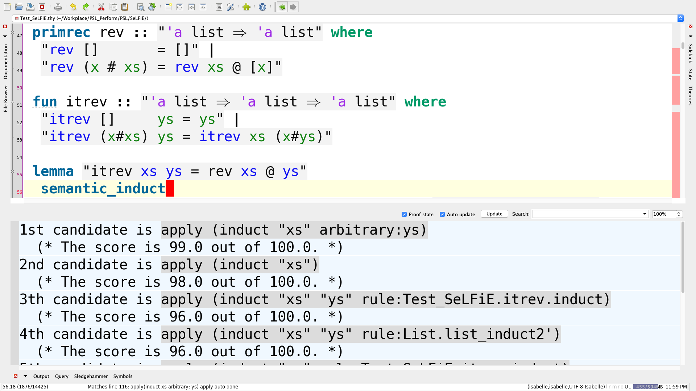

# News
- We updated this repository to Isabelle2021.
- LiFtEr and Smart_Induct are no-longer supported, since their successors, SeLFiE and sem_ind, have shown superior performance.
- This is the development version of PSL, PaMpeR, SeLFiE, and sem_ind where we try out possibly immature ideas. In case you find problems, please send your feedback.
- The main developer of this repository, Yutaka Ng, has taken a full-time position for the [SuSLik](https://github.com/TyGuS/suslik) project at Yale-NUS, and he will work on [PSL and all that](https://github.com/data61/PSL/) only in his spare time. Therefore, the progress of this project, unfortunately, will be slow for the foreseeable future. In case you find problems and requests about data61/PSL, contact Yutaka Ng (email: yutaka.nagashima@cvut.cz, twitter: [YutakangE](https://twitter.com/YutakangE)).

# Smart_Isabelle

This repository contains various tools to support interactive theorem proving in Isabelle/HOL using artificial intelligence.
This repository contains the implementation of *proof strategy language (PSL)* and its default strategy,
**try_hard**, for [Isabelle20**21**](https://isabelle.in.tum.de). Past versions of Isabelle, such as Isabelle2019, are no longer supported.

## YouTube

We opened [a YouTube channel](https://www.youtube.com/channel/UCjnY6hIaryOEgG92udvogAw/) to introduce aspects of this project.

## Installation (of SeLFiE, PaMpeR, PSL, and sem_ind in one go)
1. Install [Isabelle2021](https://isabelle.in.tum.de).
2. Download or clone this repository (git clone https://github.com/data61/PSL.git).
3. Open Isabelle/jEdit with PSL and all that. You can do this by opening Isabelle/jEdit as following:
   * `(path to the Isabelle binary)isabelle jedit -d (path to the directory that contains this README file) -l Smart_Isabelle`
   * If you are a MacOS user and your current directory is this one with this README.md, probably you should type something like this in Terminal:
   * `/Applications/Isabelle2021.app/bin/isabelle jedit -d . -l Smart_Isabelle`
4. Then, You can use SeLFiE/PaMpeR/PSL/LiFtEr/Smart_Induct to your theory files
   with the Isabelle keyword, **imports** as ``imports "Smart_Isabelle.Smart_Isabelle"``.
5. Open `Example/Example.thy` to see if the installation is successful.

If you find it difficult to install our tool, please refer to [the Isabelle System Manual](https://isabelle.in.tum.de/doc/system.pdf). Alternatively, you can just send an email to Yutaka at Yutaka.Nagashima(at)cvut.cz.

## Hints
PSL's runtime tactic generation can result in a large number of messages in Isabelle/jEdit's output panel.
This might cause Isabelle/jEdit to pause PSL's proof search after reaching its default upper limit for tracing messages.
- One can circumvent this situation by changing the upper limit to an extreamly large number, say 99999999.
- One can change the upper limit for tracing messages via jEdit's menus:
  Plugins => Plugin Options => Isabelle => General => Editor Tracing Messages.

## Documentations
We published academic papers describing the ideas implemented in this project.
- A Proof Strategy Language and Proof Script Generation for Isabelle/HOL at [CADE2017](http://www.cse.chalmers.se/~myreen/cade-26/) explains the overall idea of PSL. ([arXiv](https://arxiv.org/abs/1606.02941)/[Springer](https://doi.org/10.1007/978-3-319-63046-5_32))
- Goal-Oriented Conjecturing for Isabelle/HOL at [CICM2018](https://cicm-conference.org/2018/cicm.php) explains the conjecturing framework implemented as `Generalize` and `Conjecture` in `PSL/PGT`. ([arXiv](https://arxiv.org/abs/1806.04774)/[Springer](https://doi.org/10.1007/978-3-319-96812-4_19))
- PaMpeR: Proof Method Recommendation System for Isabelle/HOL at [ASE2018](http://ase2018.com) explains the proof method recommendation system implemented in `PSL/PaMpeR`. ([arXiv](https://arxiv.org/abs/1806.07239)/[ACM](http://doi.acm.org/10.1145/3238147.3238210))
- LiFtEr: Language to Encode Induction Heuristics for Isabelle/HOL at [APLAS2019](https://conf.researchr.org/home/aplas-2019) explains our domain specific language to encode induction heuristics. ([arXiv](https://arxiv.org/abs/1906.08084)/[Springer](https://doi.org/10.1007/978-3-030-34175-6_14))
- smart_induct: Smart Induction for Isabelle/HOL (Tool Paper) accepted at [FMCAD2020](https://fmcad.forsyte.at/FMCAD20/).  ([TU Wien Academic Press](https://doi.org/10.34727/2020/isbn.978-3-85448-042-6_32)/[Zenodo](https://doi.org/10.5281/zenodo.3960303)/[YouTube](https://youtu.be/iaH0Mx926CU).)
- Simple Dataset for Proof Method Recommendation in Isabelle/HOL (Dataset Description) at [CICM2020](https://cicm-conference.org/2020/cicm.php). ([arXiv](https://arxiv.org/abs/2004.10667)/[Springer](https://doi.org/10.1007/978-3-030-53518-6_21))

We presented the final goal of this project at [AITP2017](http://aitp-conference.org/2017/). Our position paper "Towards Smart Proof Search for Isabelle" is available at [arXiv](https://arxiv.org/abs/1701.03037).

We are currently developing ``MeLoId``, an extension to `PSL` to improve its proof automation. Our position paper "Towards Machine Learning Induction" is available at [arXiv](https://arxiv.org/abs/1812.04088). We presented this abstract at [AITP2019](http://aitp-conference.org/2019/), [LiVe2019](https://www7.in.tum.de/~kretinsk/LiVe2019.html), and [ML2019](https://icfp19.sigplan.org/home/mlfamilyworkshop-2019).

We also plan to improve the proof automation using evolutionary computation. We presented our plan during the poster session at [GECCO2019](https://gecco-2019.sigevo.org/index.html/HomePage). Our poster-only paper is available at [ACM digital library](https://doi.org/10.1145/3319619.3321921) and [arXiv](https://arxiv.org/abs/1904.08468).

## Preferred Citation
- **PSL**:
`Nagashima Y., Kumar R. (2017) A Proof Strategy Language and Proof Script Generation for Isabelle/HOL. In: de Moura L. (eds) Automated Deduction – CADE 26. CADE 2017. Lecture Notes in Computer Science, vol 10395. Springer, Cham`

- **PGT**:
`Nagashima Y., Parsert J. (2018) Goal-Oriented Conjecturing for Isabelle/HOL. In: Rabe F., Farmer W., Passmore G., Youssef A. (eds) Intelligent Computer Mathematics. CICM 2018. Lecture Notes in Computer Science, vol 11006. Springer, Cham`

- **PaMpeR**:
`Yutaka Nagashima and Yilun He. 2018. PaMpeR: proof method recommendation system for Isabelle/HOL. In Proceedings of the 33rd ACM/IEEE International Conference on Automated Software Engineering (ASE 2018). Association for Computing Machinery, New York, NY, USA, 362–372. DOI:https://doi.org/10.1145/3238147.3238210`

- **Towards Evolutionary Theorem Proving for Isabelle/HOL**:
`Yutaka Nagashima. 2019. Towards evolutionary theorem proving for Isabelle/HOL. In Proceedings of the Genetic and Evolutionary Computation Conference Companion (GECCO ’19). Association for Computing Machinery, New York, NY, USA, 419–420. DOI:https://doi.org/10.1145/3319619.3321921`

- **LiFtEr**:
`Nagashima Y. (2019) LiFtEr: Language to Encode Induction Heuristics for Isabelle/HOL. In: Lin A. (eds) Programming Languages and Systems. APLAS 2019. Lecture Notes in Computer Science, vol 11893. Springer, Cham`

- **Simple Dataset**
`Nagashima Y. (2020) Simple Dataset for Proof Method Recommendation in Isabelle/HOL. In: Benzmüller C., Miller B. (eds) Intelligent Computer Mathematics. CICM 2020. Lecture Notes in Computer Science, vol 12236. Springer, Cham. https://doi.org/10.1007/978-3-030-53518-6_21`

- **Smart Induction**
`Yutaka Nagashima. Smart Induction for Isabelle/HOL (Tool Paper). In: Ivrii A., Strichman O. (eds) Proceedings of the 20th Conference on Formal Methods in Computer-Aided Design – FMCAD 2020 DOI:https://doi.org/10.34727/2020/isbn.978-3-85448-042-6_32
`

## Screenshots
- a PSL example

- a PGT example

- a use case of semantic_induct

