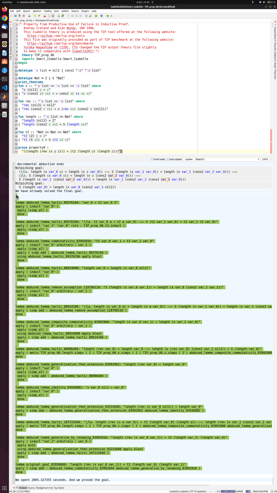

# Note on Isabelle2024 and its Sledgehammer
This repository has been updated to Isabelle2024. However, we have received reports that the integration of Sledgehammer with this repository is now less stable under Isabelle2024. Therefore, although we have confirmed that the Abduction Prover works in some cases, its performance may currently be suboptimal. We are working to resolve this issue as quickly as possible. 🙇

For users seeking the best performance, we recommend using Isabelle2023 and [this version of the Abduction Prover (v0.2.7-alpha)](https://github.com/data61/PSL/releases/tag/v0.2.7-alpha), which was developed specifically for Isabelle2023."

# News
- We updated this repository to Isabelle2024.
- _NEW_: The introduction of **Abduction Prover**. You can watch a demo of Abduction Prover in [our YouTube channel](https://youtu.be/d7IXk0vB2p0).
- LiFtEr and Smart_Induct are no-longer supported, since their successors, SeLFiE and sem_ind, have shown superior performance.
- _PaMpeR is currently not supported either,_ since we want to minimise the cost necessary to maintain this repository. 
- This is the development version of PSL, SeLFiE, and sem_ind where we try out possibly immature ideas. In case you find problems, please send your feedback.
- The main developer of this repository, Yutaka, has taken a full-time position at a private company, and he works on [PSL and all that](https://github.com/data61/PSL/) only in his spare time. Therefore, the progress of this project, unfortunately, will be slow for the foreseeable future. In case you find problems and requests about data61/PSL, contact Yutaka (email: united.reasoning+gmail.com (reaplace + with @), twitter: [YutakangE](https://twitter.com/YutakangE)) or open an issue.

# Smart_Isabelle

This repository contains various tools to support interactive theorem proving in Isabelle/HOL using artificial intelligence.
This repository contains the implementation of *proof strategy language (PSL)* and its default strategy,
**try_hard**, for [Isabelle2024](https://isabelle.in.tum.de). Past versions of Isabelle, such as Isabelle2022-1, are no longer supported.

## YouTube

We opened [a YouTube channel](https://www.youtube.com/channel/UCjnY6hIaryOEgG92udvogAw/) to introduce aspects of this project.

## Installation (of SeLFiE, PSL, and sem_ind in one go) (for MacOS/Lunux users)
1. Install [Isabelle2024](https://isabelle.in.tum.de).
2. Download or clone this repository (git clone https://github.com/data61/PSL.git).
3. Open Isabelle/jEdit with PSL and all that. You can do this by opening Isabelle/jEdit as following:
   * `(path to the Isabelle binary)isabelle jedit -d (path to the directory that contains this README file) -l Smart_Isabelle`
   * If you are a MacOS user and your current directory is this one with this README.md, probably you should type something like this in Terminal:
   * `/Applications/Isabelle2024.app/bin/isabelle jedit -d . -l Smart_Isabelle`
4. Then, You can use SeLFiE/PSL/sem_ind to your theory files
   with the Isabelle keyword, **imports** as ``imports "Smart_Isabelle.Smart_Isabelle"``.
5. Open `Example/Example.thy` to see if the installation is successful.

### Note on installation for Windows users
The basic steps are the same as MacOS and Linux. 
However, instead of using the binary file directly, use `Isabelle2024\Cygwin-Terminal` in Command Prompt. Once you start `Isabelle2024\Cygwin-Terminal`, you can install our tools by typing `isabelle jedit -d (path to the directory that contains this README file) -l Smart_Isabelle`. Note that once you started `Isabelle2024\Cygwin-Terminal`, you should not specify the path to the Isabelle binary file. Therefore, the command you need after starting `Isabelle2024\Cygwin-Terminal` is something like `isabelle jedit -d . -l Smart_Isabelle`, assuming that your current directory is this one with this README.md/

If you find it difficult to install our tool, please refer to [the Isabelle System Manual](https://isabelle.in.tum.de/doc/system.pdf). Alternatively, you can just send an email to Yutaka at **united.reasoning+gmail.com (reaplace + with @)**.

## Hints
PSL's runtime tactic generation can result in a large number of messages in Isabelle/jEdit's output panel.
This might cause Isabelle/jEdit to pause PSL's proof search after reaching its default upper limit for tracing messages.
- One can circumvent this situation by changing the upper limit to an extreamly large number, say 99999999.
- One can change the upper limit for tracing messages via jEdit's menus:
  Plugins => Plugin Options => Isabelle => General => Editor Tracing Messages.

## Documentations
We published academic papers describing the ideas implemented in this project.
- A Proof Strategy Language and Proof Script Generation for Isabelle/HOL at [CADE2017](http://www.cse.chalmers.se/~myreen/cade-26/) explains the overall idea of PSL. ([arXiv](https://arxiv.org/abs/1606.02941)/[Springer](https://doi.org/10.1007/978-3-319-63046-5_32))
- Goal-Oriented Conjecturing for Isabelle/HOL at [CICM2018](https://cicm-conference.org/2018/cicm.php) explains the conjecturing framework implemented as `Generalize` and `Conjecture` in `PSL/PGT`. ([arXiv](https://arxiv.org/abs/1806.04774)/[Springer](https://doi.org/10.1007/978-3-319-96812-4_19))
- PaMpeR: Proof Method Recommendation System for Isabelle/HOL at [ASE2018](http://ase2018.com) explains the proof method recommendation system implemented in `PSL/PaMpeR`. ([arXiv](https://arxiv.org/abs/1806.07239)/[ACM](http://doi.acm.org/10.1145/3238147.3238210)) Note that _PaMpeR is currently not supported to minimise the cost to maintain this repository._
- LiFtEr: Language to Encode Induction Heuristics for Isabelle/HOL at [APLAS2019](https://conf.researchr.org/home/aplas-2019) explains our domain specific language to encode induction heuristics. ([arXiv](https://arxiv.org/abs/1906.08084)/[Springer](https://doi.org/10.1007/978-3-030-34175-6_14))
- smart_induct: Smart Induction for Isabelle/HOL (Tool Paper) accepted at [FMCAD2020](https://fmcad.forsyte.at/FMCAD20/).  ([TU Wien Academic Press](https://doi.org/10.34727/2020/isbn.978-3-85448-042-6_32)/[Zenodo](https://doi.org/10.5281/zenodo.3960303)/[YouTube](https://youtu.be/iaH0Mx926CU).)
- Simple Dataset for Proof Method Recommendation in Isabelle/HOL (Dataset Description) at [CICM2020](https://cicm-conference.org/2020/cicm.php). ([arXiv](https://arxiv.org/abs/2004.10667)/[Springer](https://doi.org/10.1007/978-3-030-53518-6_21))
- sem_ind: Faster Smarter Proof by Induction in Isabelle/HOL at IJCAI2021 explains how sem_ind predicts how to apply proof by induction. ([IJCAI](https://doi.org/10.24963/ijcai.2021/273)/[YouTube](https://youtu.be/4umf8Zhjy7c))
- SeLFiE: Definitional Quantifiers Realise Semantic Reasoning for Proof by Induction at [TAP2022](https://easychair.org/smart-program/TAP22/) explains the idea and interpreter of SeLFiE, which we developed to implement sem_ind. ([arXiv](https://arxiv.org/abs/2010.10296)/[Springer](https://doi.org/10.1007/978-3-031-09827-7_4))
- TBC: Template-Based Conjecturing for Automated Induction in Isabelle/HOL at [FSEN2023](http://fsen.ir/2023/). ([arXiv](https://doi.org/10.48550/arXiv.2212.11151)/[Springer](https://doi.org/10.1007/978-3-031-42441-0_9))

We presented the final goal of this project at [AITP2017](http://aitp-conference.org/2017/). Our position paper "Towards Smart Proof Search for Isabelle" is available at [arXiv](https://arxiv.org/abs/1701.03037).

We also plan to improve the proof automation using evolutionary computation. We presented our plan during the poster session at [GECCO2019](https://gecco-2019.sigevo.org/index.html/HomePage). Our poster-only paper is available at [ACM digital library](https://doi.org/10.1145/3319619.3321921) and [arXiv](https://arxiv.org/abs/1904.08468).

## Preferred Citation
- **PSL**: `Nagashima, Y., Kumar, R. (2017). A Proof Strategy Language and Proof Script Generation for Isabelle/HOL. In: de Moura, L. (eds) Automated Deduction – CADE 26. CADE 2017. Lecture Notes in Computer Science(), vol 10395. Springer, Cham. https://doi.org/10.1007/978-3-319-63046-5_32`

- **PGT**: `Nagashima, Y., Parsert, J. (2018). Goal-Oriented Conjecturing for Isabelle/HOL. In: Rabe, F., Farmer, W., Passmore, G., Youssef, A. (eds) Intelligent Computer Mathematics. CICM 2018. Lecture Notes in Computer Science(), vol 11006. Springer, Cham. https://doi.org/10.1007/978-3-319-96812-4_19`

- **PaMpeR**: `Yutaka Nagashima and Yilun He. 2018. PaMpeR: proof method recommendation system for Isabelle/HOL. In Proceedings of the 33rd ACM/IEEE International Conference on Automated Software Engineering (ASE 2018). Association for Computing Machinery, New York, NY, USA, 362–372. DOI:https://doi.org/10.1145/3238147.3238210`

- **Towards Evolutionary Theorem Proving for Isabelle/HOL**: `Yutaka Nagashima. 2019. Towards evolutionary theorem proving for Isabelle/HOL. In Proceedings of the Genetic and Evolutionary Computation Conference Companion (GECCO ’19). Association for Computing Machinery, New York, NY, USA, 419–420. DOI:https://doi.org/10.1145/3319619.3321921`

- **LiFtEr**: `Nagashima, Y. (2019). LiFtEr: Language to Encode Induction Heuristics for Isabelle/HOL. In: Lin, A. (eds) Programming Languages and Systems. APLAS 2019. Lecture Notes in Computer Science(), vol 11893. Springer, Cham. https://doi.org/10.1007/978-3-030-34175-6_14`

- **Simple Dataset**
`Nagashima Y. (2020) Simple Dataset for Proof Method Recommendation in Isabelle/HOL. In: Benzmüller C., Miller B. (eds) Intelligent Computer Mathematics. CICM 2020. Lecture Notes in Computer Science, vol 12236. Springer, Cham. https://doi.org/10.1007/978-3-030-53518-6_21`

- **Smart Induction**
`Yutaka Nagashima. Smart Induction for Isabelle/HOL (Tool Paper). In: Ivrii A., Strichman O. (eds) Proceedings of the 20th Conference on Formal Methods in Computer-Aided Design – FMCAD 2020 DOI:https://doi.org/10.34727/2020/isbn.978-3-85448-042-6_32`

- **sem_ind**
`Yutaka Nagashima. Faster Smarter Proof by Induction in Isabelle/HOL. Proceedings of the Thirtieth International Joint Conference on Artificial Intelligence Main Track. Pages 1981-1988 DOI:https://doi.org/10.24963/ijcai.2021/273`

- **Definitional Quantifier and SeLFiE**
`Nagashima, Y. (2022). Definitional Quantifiers Realise Semantic Reasoning for Proof by Induction. In: Kovács, L., Meinke, K. (eds) Tests and Proofs. TAP 2022. Lecture Notes in Computer Science, vol 13361. Springer, Cham. https://doi.org/10.1007/978-3-031-09827-7_4`

- **Template-Based Conjecturing**
`Nagashima, Y., Xu, Z., Wang, N., Goc, D.S., Bang, J. (2023). Template-Based Conjecturing for Automated Induction in Isabelle/HOL. In: Hojjat, H., Ábrahám, E. (eds) Fundamentals of Software Engineering. FSEN 2023. Lecture Notes in Computer Science, vol 14155 . Springer, Cham. https://doi.org/10.1007/978-3-031-42441-0_9`

## Screenshots
### PSL example

### Abduction Prover example

