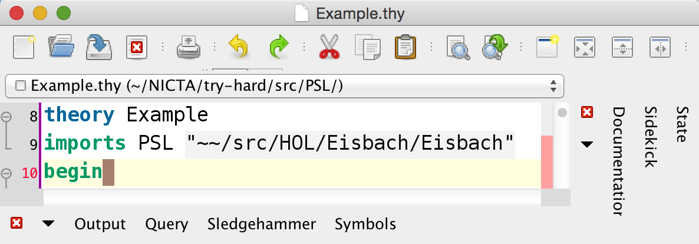
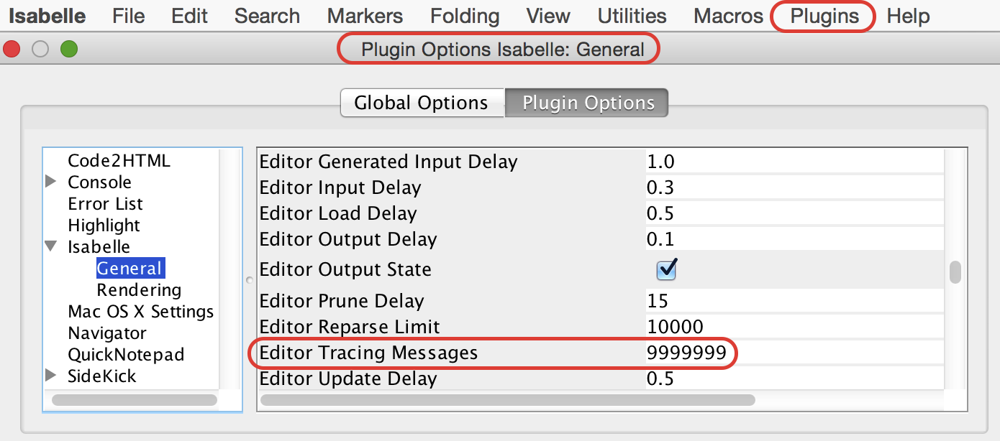
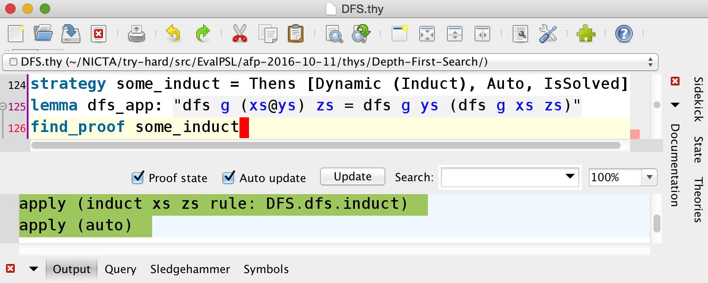
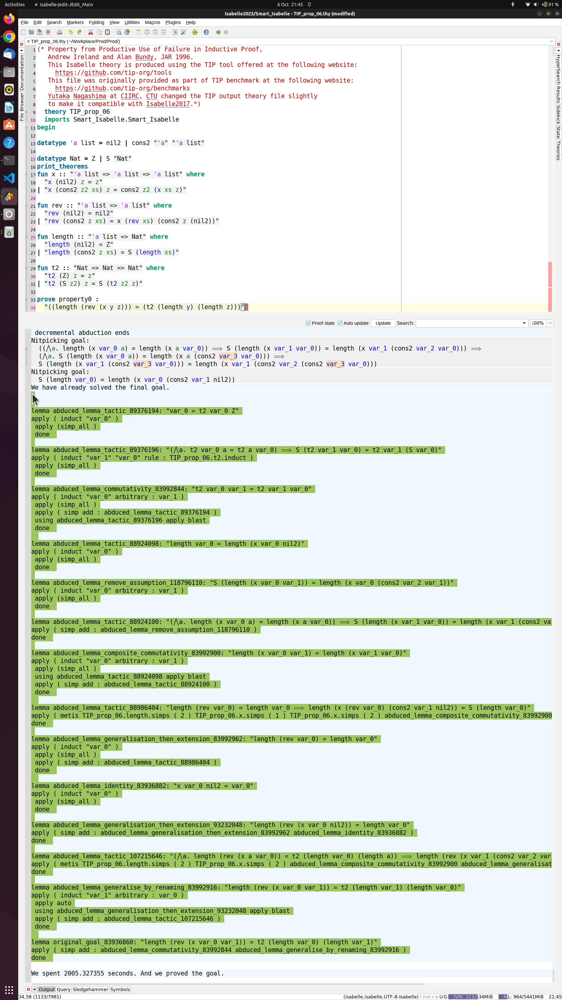

# News
- We updated this repository to Isabelle2025.
- _NEW_: The introduction of **Abduction Prover**. You can watch a demo of Abduction Prover in [our YouTube channel](https://youtu.be/d7IXk0vB2p0).
- LiFtEr and Smart_Induct are no-longer supported, since their successors, SeLFiE and sem_ind, have shown superior performance.
- _PaMpeR is currently not supported either,_ since we want to minimise the cost necessary to maintain this repository. 
- This is the development version of PSL, SeLFiE, and sem_ind where we try out possibly immature ideas. In case you find problems, please send your feedback.
- In case you find problems and requests about data61/PSL, contact Yutaka (email: nagashima+cs.cas.cz _and_ united.reasoning+gmail.com(reaplace + with @)) or open an issue.

# Smart_Isabelle

This repository contains various tools to support interactive theorem proving in Isabelle/HOL using artificial intelligence.
This repository contains the implementation of *proof strategy language (PSL)* and its default strategy,
**try_hard**, for [Isabelle2025](https://isabelle.in.tum.de). Past versions of Isabelle, such as Isabelle2022-1, are no longer supported.

## YouTube

We opened [a YouTube channel](https://www.youtube.com/channel/UCjnY6hIaryOEgG92udvogAw/) to introduce aspects of this project.

[](https://www.youtube.com/watch?v=rXU-lJxP_GI)


## Installation (of SeLFiE, PSL, and sem_ind in one go) (for MacOS/Lunux users)
1. Install [Isabelle2025-2](https://isabelle.in.tum.de).
2. Download or clone this repository (git clone https://github.com/data61/PSL.git).
3. Open Isabelle/jEdit with PSL and all that. You can do this by opening Isabelle/jEdit as following:
   * `(path to the Isabelle binary)isabelle jedit -d (path to the directory that contains this README file) -l Smart_Isabelle`
   * If you are a MacOS user and your current directory is this one with this README.md, probably you should type something like this in Terminal:
   * `/Applications/Isabelle2025.app/bin/isabelle jedit -d . -l Smart_Isabelle`
4. Then, You can use SeLFiE/PSL/sem_ind to your theory files
   with the Isabelle keyword, **imports** as ``imports "Smart_Isabelle.Smart_Isabelle"``.
5. Open `Example/Example.thy` to see if the installation is successful.

### Note on installation for Windows users
The basic steps are the same as MacOS and Linux. 
However, instead of using the binary file directly, use `Isabelle2025-2\Cygwin-Terminal` in Command Prompt. Once you start `Isabelle2025-2\Cygwin-Terminal`, you can install our tools by typing `isabelle jedit -d (path to the directory that contains this README file) -l Smart_Isabelle`. Note that once you started `Isabelle2025-2\Cygwin-Terminal`, you should not specify the path to the Isabelle binary file. Therefore, the command you need after starting `Isabelle2025-2\Cygwin-Terminal` is something like `isabelle jedit -d . -l Smart_Isabelle`, assuming that your current directory is this one with this README.md/



If you find it difficult to install our tool, please refer to [the Isabelle System Manual](https://isabelle.in.tum.de/doc/system.pdf). Alternatively, you can just send an email to Yutaka at **united.reasoning+gmail.com (reaplace + with @)**.

## Hints

### Invoking AbductionProver mid-proof
`prove`/`prove_by_abduction` only work at the very start of a proof attempt: they parse a
fresh top-level goal statement, so they cannot be used inside a structured Isar proof
(after `proof (induct x)`, at a `show`/`case`) or partway through a chain of `apply`
steps. `suggest`/`solve` lift this restriction: like
`sledgehammer`/`find_proof`/`try_hard`, they read the goal from whichever proof is
*currently open*, wherever that is - inside a structured proof, or mid an `apply` chain -
and only ever attack subgoal 1, matching `apply`'s own convention.

`suggest` prints a suggested proof script rather than closing the goal itself, for
you to copy in by hand:
```
lemma foo: "..."
proof (induct x)
  case (Suc x)
  suggest  (* suggests a script for this subgoal, using Suc.IH etc. as available *)
  ...
```
Any auxiliary lemmas it needed are suggested as their own `have name: "..." for ...` blocks
nested inside the current proof (a top-level `lemma` would be illegal syntax while a proof is
already open); the goal itself is suggested as a bare tactic script with no such header, ready
to paste in directly as the continuation of the current proof.

`solve` runs the same search but, if successful, applies the found proof directly
and closes the goal itself - no copying required:
```
lemma foo: "..."
proof (induct x)
  case (Suc x)
  solve  (* closes this subgoal automatically, if AbductionProver finds a proof *)
  ...
```
It works equally well directly after `proof -` (with no `show` yet) and mid an `apply` chain
at the bottom of a proof, closing exactly as `done` would there. If AbductionProver cannot
find a proof, `solve` raises an error rather than silently leaving the goal open -
try `suggest` at that point to see whatever progress it made.

PSL's runtime tactic generation can result in a large number of messages in Isabelle/jEdit's output panel.
This might cause Isabelle/jEdit to pause PSL's proof search after reaching its default upper limit for tracing messages.
- One can circumvent this situation by changing the upper limit to an extreamly large number, say 99999999.
- One can change the upper limit for tracing messages via jEdit's menus:
  Plugins => Plugin Options => Isabelle => General => Editor Tracing Messages.


### Proof search unexpectedly slow on cloud/VM machines: set `threads` explicitly
Isabelle's default `threads = 0` ("guess from hardware") relies on Poly/ML's physical-core
detection (`Thread.Thread.numPhysicalProcessors`), which can badly under-count CPU cores on
cloud/KVM virtual machines whose `/proc/cpuinfo` reports each vCPU as its own single-core
`physical id` (a common vCPU topology on many cloud providers). When this happens,
`isabelle build`/`isabelle jedit` can end up running with effectively **1 worker thread**,
even on an 8-, 16-, or 32-core VM. PSL, TBC, and AbductionProver rely heavily on
`Par_List`/`POrs`-style parallelism (e.g. `Par_List.get_some`, which *does* run alternative
tactics in parallel and cancel the losers once one succeeds, exactly as documented) &mdash; but
with only 1 thread available, those "parallel" alternatives are effectively tried one at a
time, so even a trivial one-step-induction goal can take minutes instead of seconds.

**Symptom:** a goal that should take a few seconds instead takes minutes, and
`isabelle build -v` reports `(1 threads, ...)` in its timing summary even though the
machine has many more cores (check with `nproc`).

**Fix:** always pass the real core count explicitly, e.g.:
```
isabelle build -o threads=$(nproc) -d . <session>
isabelle jedit -o threads=$(nproc) -d . -l Smart_Isabelle
```
Note: a `threads` value baked into a session's `ROOT` file `options [...]` clause takes
*priority over* `-o threads=...` on the command line (confirmed empirically), so we
deliberately do not hardcode a `threads` default in this repository's `ROOT` files &mdash;
always pass `-o threads=$(nproc)` per invocation instead, so it stays correct across
machines of any size.

### Sledgehammer exhausting machine memory: bound each prover, and size the hammer budget to RAM

Isabelle bounds an external prover's *time* but not its *memory* &mdash; veriT, for instance, is
invoked with only `--max-time`. A prover that starts diverging therefore allocates freely until it
finishes, its time budget expires, or the machine runs out of memory. Measured here: a single
diverging veriT reached **6.35GB** while the Isabelle ML process held only 1.9GB, so capping the ML
heap alone does not help &mdash; it merely leaves more room for the provers to take.

**Symptom:** a run dies with the OS OOM killer, with Poly/ML's `Run out of store`, or with
AbductionProver's own `stopping early: running low on memory`. In the recorded position matrix this
was 12 of 37 runs.

There are two limits, at two levels, and they share one number.

**1. How many Sledgehammer invocations run at once** (on by default). The budget used to be derived
from processors alone &mdash; `cores / 2`, so six concurrent invocations on a 12-core machine, each
launching every prover in `sledgehammer_provers`, against a machine one prover can fill by itself.
It now answers to memory as well:

```
slots = max(1, min(cores / 2, free_memory_MB / hammer_memory_quota_mb))
```

Read against free memory rather than total, so the budget narrows as a search grows. Override
either part from a theory:

```isabelle
declare [[max_parallel_hammers = 4]]     (* explicit slot count, wins outright *)
declare [[hammer_memory_quota_mb = 3072]] (* memory assumed per invocation; default 2048 *)
```

**2. A ceiling on each external prover process** (**off by default**, opt-in). Isabelle locates every
prover through a settings variable, so the only place a per-process limit can be imposed is between
that variable and the real binary &mdash; not from ML, which never sees the launch. Register this
repository as an Isabelle *component* and its `etc/settings` points those variables at wrappers in
`contrib/prover_wrappers`, keeping the originals in `PSL_REAL_<VARIABLE>`:

```
echo /path/to/PSL >> "$(isabelle getenv -b ISABELLE_HOME_USER)/etc/components"
```

With that done, nothing changes until you ask for a limit:

```
PSL_PROVER_MEMORY_MB=2048 isabelle build -o threads=$(nproc) <session>
```

Each prover then runs in its own transient cgroup with that resident-memory ceiling
(`systemd-run --user --scope -p MemoryMax=...`, plus `MemorySwapMax=0`, because a ceiling a solver
can page around is not a ceiling). A prover that exceeds it is killed; Sledgehammer records that
prover as failed and carries on with the others, and the session survives. Keep this number and
`hammer_memory_quota_mb` in step: one decides how many provers are admitted, the other what each is
allowed, and if they disagree the search admits more provers than the machine has ceilings for.

Three things to know before enabling it:

* **It is not yet validated, and it is not the first attempt.** An earlier version used `ulimit -v`
  and *cost proofs*: `TIP_sort_SSortCount` went from 2/2 to 0/2, and raising the cap to 3500MB did
  not bring the proof back. The diagnosis was that `ulimit -v` caps *virtual address space*, so a
  solver that reserves a range it never touches is killed for memory it never used. A cgroup charges
  a solver only for what it touches, which is why this is worth retrying &mdash; but
  `TIP_sort_SSortCount` returning to 2/2 is the acceptance test and has not been run.
* **It needs cgroup v2 and a user session bus** (`$XDG_RUNTIME_DIR/bus`). Without them the wrapper
  execs the real binary unlimited rather than failing to start it, so a machine without systemd
  simply gets no ceiling.
* **Registering the component also registers this repository's sessions.** You can then
  `isabelle build Abduction` without `-d`, but passing `-d` to a *copy* of this tree will fail with
  `Duplicate session`. If you build from snapshots, register the component only on the machine where
  you want the wrappers.

The validated fallback, if you would rather not enable the wrappers, remains an ML heap ceiling plus
the hammer budget (see `Eval/run_eval.sh`): those converted every SIGKILL tested into a completed
run and left 6/6 previously-succeeding targets still succeeding.

## Documentations
We published academic papers describing the ideas implemented in this project.
- A Proof Strategy Language and Proof Script Generation for Isabelle/HOL at [CADE2017](http://www.cse.chalmers.se/~myreen/cade-26/) explains the overall idea of PSL. ([arXiv](https://arxiv.org/abs/1606.02941)/[Springer](https://doi.org/10.1007/978-3-319-63046-5_32))
- Goal-Oriented Conjecturing for Isabelle/HOL at [CICM2018](https://cicm-conference.org/2018/cicm.php) explains the conjecturing framework implemented as `Generalize` and `Conjecture` in `PSL/PGT`. ([arXiv](https://arxiv.org/abs/1806.04774)/[Springer](https://doi.org/10.1007/978-3-319-96812-4_19))
- PaMpeR: Proof Method Recommendation System for Isabelle/HOL at [ASE2018](http://ase2018.com) explains the proof method recommendation system implemented in `PSL/PaMpeR`. ([arXiv](https://arxiv.org/abs/1806.07239)/[ACM](http://doi.acm.org/10.1145/3238147.3238210)) Note that _PaMpeR is currently not supported to minimise the cost to maintain this repository._
- LiFtEr: Language to Encode Induction Heuristics for Isabelle/HOL at [APLAS2019](https://conf.researchr.org/home/aplas-2019) explains our domain specific language to encode induction heuristics. ([arXiv](https://arxiv.org/abs/1906.08084)/[Springer](https://doi.org/10.1007/978-3-030-34175-6_14))
- smart_induct: Smart Induction for Isabelle/HOL (Tool Paper) accepted at [FMCAD2020](https://fmcad.forsyte.at/FMCAD20/).  ([TU Wien Academic Press](https://doi.org/10.34727/2020/isbn.978-3-85448-042-6_32)/[Zenodo](https://doi.org/10.5281/zenodo.3960303)/[YouTube](https://youtu.be/iaH0Mx926CU).)
- Simple Dataset for Proof Method Recommendation in Isabelle/HOL (Dataset Description) at [CICM2020](https://cicm-conference.org/2020/cicm.php). ([arXiv](https://arxiv.org/abs/2004.10667)/[Springer](https://doi.org/10.1007/978-3-030-53518-6_21))
- sem_ind: Faster Smarter Proof by Induction in Isabelle/HOL at IJCAI2021 explains how sem_ind predicts how to apply proof by induction. ([IJCAI](https://doi.org/10.24963/ijcai.2021/273)/[YouTube](https://youtu.be/4umf8Zhjy7c))
- SeLFiE: Definitional Quantifiers Realise Semantic Reasoning for Proof by Induction at [TAP2022](https://easychair.org/smart-program/TAP22/) explains the idea and interpreter of SeLFiE, which we developed to implement sem_ind. ([arXiv](https://arxiv.org/abs/2010.10296)/[Springer](https://doi.org/10.1007/978-3-031-09827-7_4))
- TBC: Template-Based Conjecturing for Automated Induction in Isabelle/HOL at [FSEN2023](http://fsen.ir/2023/). ([arXiv](https://doi.org/10.48550/arXiv.2212.11151)/[Springer](https://doi.org/10.1007/978-3-031-42441-0_9))

We presented the final goal of this project at [AITP2017](http://aitp-conference.org/2017/). Our position paper "Towards Smart Proof Search for Isabelle" is available at [arXiv](https://arxiv.org/abs/1701.03037).

We also plan to improve the proof automation using evolutionary computation. We presented our plan during the poster session at [GECCO2019](https://gecco-2019.sigevo.org/index.html/HomePage). Our poster-only paper is available at [ACM digital library](https://doi.org/10.1145/3319619.3321921) and [arXiv](https://arxiv.org/abs/1904.08468).

## Preferred Citation
- **PSL**: `Nagashima, Y., Kumar, R. (2017). A Proof Strategy Language and Proof Script Generation for Isabelle/HOL. In: de Moura, L. (eds) Automated Deduction – CADE 26. CADE 2017. Lecture Notes in Computer Science(), vol 10395. Springer, Cham. https://doi.org/10.1007/978-3-319-63046-5_32`

- **PGT**: `Nagashima, Y., Parsert, J. (2018). Goal-Oriented Conjecturing for Isabelle/HOL. In: Rabe, F., Farmer, W., Passmore, G., Youssef, A. (eds) Intelligent Computer Mathematics. CICM 2018. Lecture Notes in Computer Science(), vol 11006. Springer, Cham. https://doi.org/10.1007/978-3-319-96812-4_19`

- **PaMpeR**: `Yutaka Nagashima and Yilun He. 2018. PaMpeR: proof method recommendation system for Isabelle/HOL. In Proceedings of the 33rd ACM/IEEE International Conference on Automated Software Engineering (ASE 2018). Association for Computing Machinery, New York, NY, USA, 362–372. DOI:https://doi.org/10.1145/3238147.3238210`

- **Towards Evolutionary Theorem Proving for Isabelle/HOL**: `Yutaka Nagashima. 2019. Towards evolutionary theorem proving for Isabelle/HOL. In Proceedings of the Genetic and Evolutionary Computation Conference Companion (GECCO ’19). Association for Computing Machinery, New York, NY, USA, 419–420. DOI:https://doi.org/10.1145/3319619.3321921`

- **LiFtEr**: `Nagashima, Y. (2019). LiFtEr: Language to Encode Induction Heuristics for Isabelle/HOL. In: Lin, A. (eds) Programming Languages and Systems. APLAS 2019. Lecture Notes in Computer Science(), vol 11893. Springer, Cham. https://doi.org/10.1007/978-3-030-34175-6_14`

- **Simple Dataset**
`Nagashima Y. (2020) Simple Dataset for Proof Method Recommendation in Isabelle/HOL. In: Benzmüller C., Miller B. (eds) Intelligent Computer Mathematics. CICM 2020. Lecture Notes in Computer Science, vol 12236. Springer, Cham. https://doi.org/10.1007/978-3-030-53518-6_21`

- **Smart Induction**
`Yutaka Nagashima. Smart Induction for Isabelle/HOL (Tool Paper). In: Ivrii A., Strichman O. (eds) Proceedings of the 20th Conference on Formal Methods in Computer-Aided Design – FMCAD 2020 DOI:https://doi.org/10.34727/2020/isbn.978-3-85448-042-6_32`

- **sem_ind**
`Yutaka Nagashima. Faster Smarter Proof by Induction in Isabelle/HOL. Proceedings of the Thirtieth International Joint Conference on Artificial Intelligence Main Track. Pages 1981-1988 DOI:https://doi.org/10.24963/ijcai.2021/273`

- **Definitional Quantifier and SeLFiE**
`Nagashima, Y. (2022). Definitional Quantifiers Realise Semantic Reasoning for Proof by Induction. In: Kovács, L., Meinke, K. (eds) Tests and Proofs. TAP 2022. Lecture Notes in Computer Science, vol 13361. Springer, Cham. https://doi.org/10.1007/978-3-031-09827-7_4`

- **Template-Based Conjecturing**
`Nagashima, Y., Xu, Z., Wang, N., Goc, D.S., Bang, J. (2023). Template-Based Conjecturing for Automated Induction in Isabelle/HOL. In: Hojjat, H., Ábrahám, E. (eds) Fundamentals of Software Engineering. FSEN 2023. Lecture Notes in Computer Science, vol 14155 . Springer, Cham. https://doi.org/10.1007/978-3-031-42441-0_9`

## Screenshots
### PSL example


### Abduction Prover example

